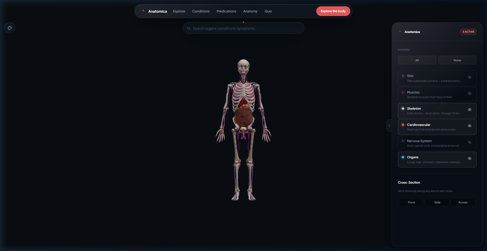
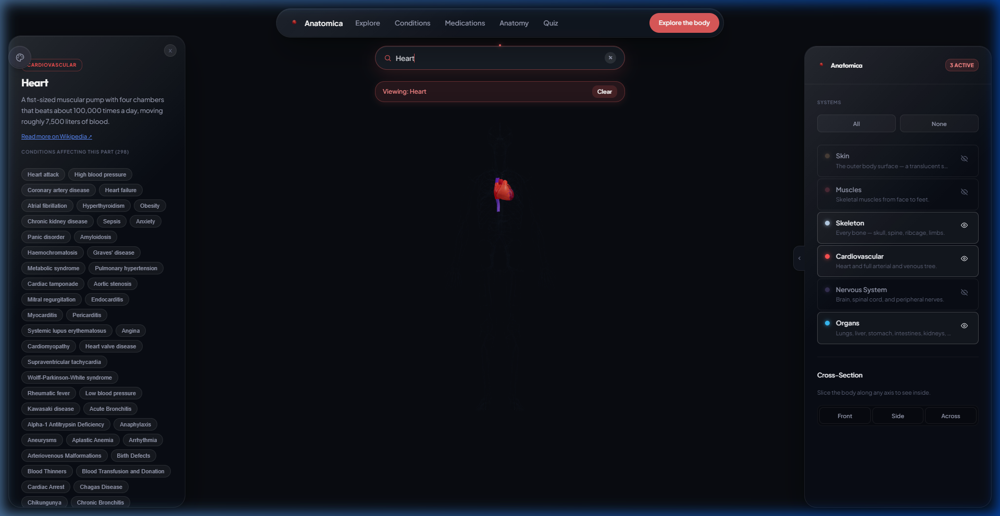
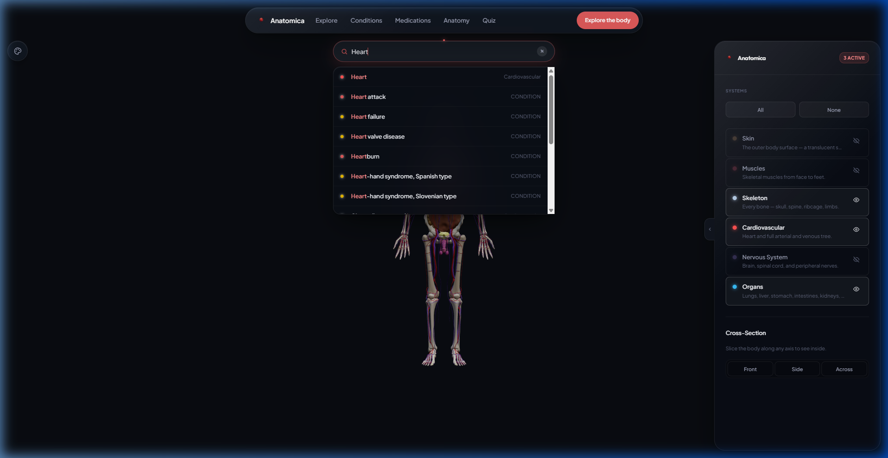
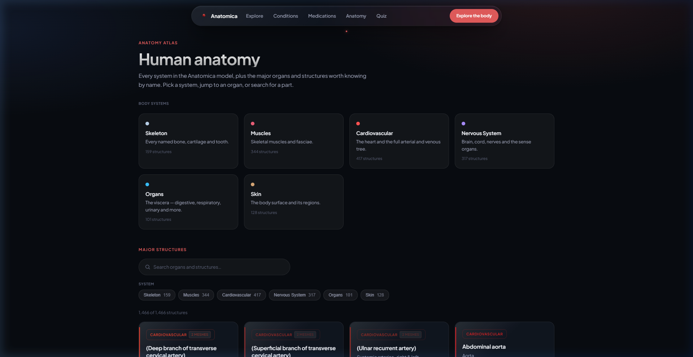
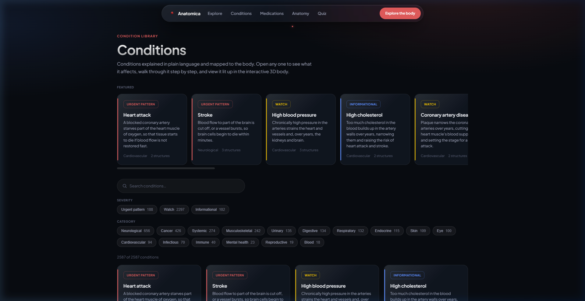
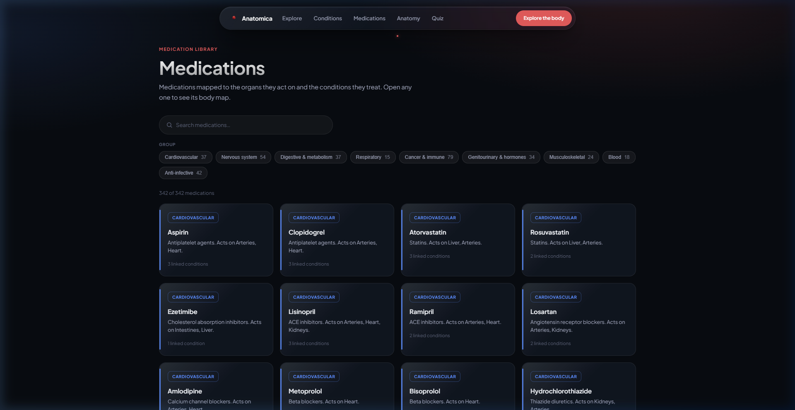
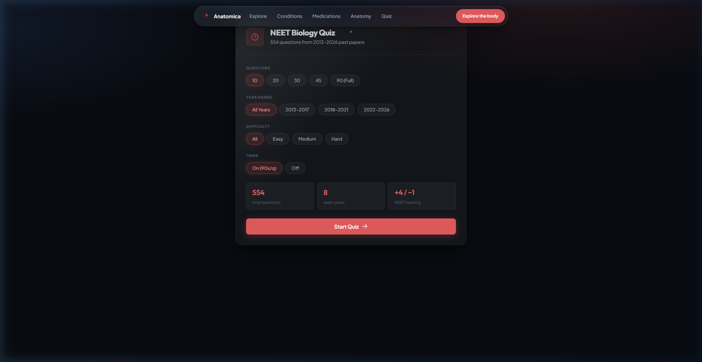

<div align="center">

<br/>


# Anatomy101

**A high-fidelity, interactive 3D human body atlas — built entirely in the browser.**

Explore every bone, vessel, nerve, and organ in real-time 3D. Search 2,587 clinical conditions, 342 medications, and 1,466 named anatomy101l structures. No install. No app. Just open and explore.

<br/>

[](https://developer.mozilla.org/en-US/docs/Web/JavaScript)
[](https://threejs.org/)
[](https://www.khronos.org/webgl/)
[](https://github.com/abachaa/MedQuAD)
[](LICENSE)

<br/>



*Full skeleton · cardiovascular system · organs — all loaded simultaneously, all interactive.*

</div>

---

## ✦ What Is Anatomy101?

Anatomy101 is a **browser-native 3D human anatomy atlas** powered by WebGL and Three.js. It renders six complete anatomy101l systems simultaneously — skeleton, muscles, cardiovascular, nervous system, organs, and skin — and lets you peel them back layer by layer to see exactly what lies beneath.

It is not a textbook. It is not a medical app. It is the anatomy atlas that *should* exist on the web: fast, beautiful, and free.

---

## 🖼️ Screenshots

<table>
<tr>
<td width="50%">

### 🫀 Organ Search & Deep Highlight

Type any organ name. Anatomy101 isolates it in the 3D viewport, ghosts all surrounding tissue, and opens a sidebar packed with a Wikipedia description, 298 linked conditions, related medications, and healthy habits.



</td>
<td width="50%">

### 🔍 Instant Search with Typeahead

The unified search bar resolves organs, conditions, and medications simultaneously. Results are ranked by relevance — anatomy first, then conditions, then meds — with colour-coded severity indicators.



</td>
</tr>
<tr>
<td width="50%">

### 🧬 Anatomy Atlas — 1,466 Structures

Every named structure from the Z-Anatomy GLB taxonomy is listed, filterable by system, and searchable. Click any card to fly directly to that structure in the 3D model.



</td>
<td width="50%">

### 🦠 Conditions Library — 2,587 Entries

All conditions sourced from NIH MedQuAD and GARD, with severity classification (Urgent / Watch / Informational), causes, prevention, body parts affected, and NIH citation links.



</td>
</tr>
</table>

<div align="center">

### 💊 Medications Library — 342 Drugs, 9 Groups



*Every drug mapped to the organs it acts on and the conditions it treats. Click any card to open the body map.*

</div>

<table>
<tr>
<td>

### 🧪 NEET Biology Quiz — 554 Questions, 2013–2026

A full-featured exam simulator built into the atlas. Configure question count, year range (2013–2017 · 2018–2021 · 2022–2026), difficulty, and timer mode. After the session, a dedicated results screen breaks down performance by year, identifies weak topics, gives personalised improvement tips, and lets you review every wrong answer with the correct explanation.



</td>
</tr>
</table>

---

## ✨ Features

### 🧠 Interactive 3D Viewer
- **Six complete body systems** rendered simultaneously in WebGL: skeleton · muscles · cardiovascular · nervous system · organs · skin
- **Per-system toggle** — show or hide any system with a single click; opacity is preserved so ghosted layers stay visible for context
- **Per-structure deterministic colour** — each of the 1,466 structures has its own consistent HSL colour derived from its anatomy label, so the Femoral artery is never the same shade as the Popliteal artery
- **Raycasting on every mesh** — click any point on the model to identify the structure name, system, and region instantly
- **Orbit, zoom, and pan** with smooth inertia via Three.js OrbitControls

### 🔍 Unified Search
- Searches **anatomy**, **conditions**, and **medications** from a single bar
- Typeahead suggestions appear in under 50 ms (in-memory index, no network request)
- Selecting an anatomy result isolates the part in 3D with a smooth camera fly-to animation
- Selecting a condition opens a full panel with causes, prevention, and affected parts highlighted live on the model

### ✂️ Cross-Section Tool
- Slice the body **front-to-back**, **side-to-side**, or **across** along the X/Y/Z axis
- Drag the depth slider to sweep through the full body volume in real time
- All six systems clip simultaneously at the same plane — no visual seam

### 🚶 Guided Walkthrough Mode
- Per-organ walkthroughs driven by NIH condition data
- Each step highlights affected parts and shows causes + prevention text
- **Cardiac pulse animation** on active parts — rate adapts per organ: Heart 72 bpm, Lungs 16/min, Brain 30/min, default 48 bpm
- Scale swell + emissive glow creates a living, breathing feel

### 🦠 Clinical Conditions Database
- **2,587 conditions** sourced from NIH MedQuAD (1,583 entries) and GARD (2,685 parsed records)
- Every entry has: category, severity, affected parts, causes, prevention, symptoms, NIH source + URL
- Filter by **14 categories** (Neurological, Cancer, Musculoskeletal, Urinary…) and **3 severity levels**
- Urgent Pattern conditions are flagged in red; informational entries in teal

### 💊 Medications Library
- **342 medications** across 9 therapeutic groups
- Each drug mapped to: drug class · target organs · linked conditions
- Click any medication card to open the 3D body map with affected organs highlighted

### 🧬 Anatomy Directory
- **1,466 structures** from the complete Z-Anatomy GLB taxonomy
- Filterable by all 6 body systems, searchable by label or anatomy101l region
- Infinite-scroll rendering (120 cards per page) keeps performance instant even at full scale
- Each card links directly to the 3D model for one-click highlight

### 🧪 NEET Biology Quiz
- **554 questions** drawn from actual NEET Biology past papers spanning 2013–2026
- Configurable before each session: question count (10 / 20 / 30 / 45 / 90), year range, difficulty (Easy / Medium / Hard), and a 90-second-per-question countdown timer
- **Official NEET marking scheme** — +4 for correct, −1 for wrong, 0 for skipped
- Real-time progress bar and per-question year/type/difficulty badges during the quiz
- **Results screen** with an animated SVG score ring, correct/wrong/skipped breakdown, and accuracy percentage
- **Performance-by-year bar chart** — see exactly which exam years you struggle with
- **Weak area analysis** — topics with the most wrong answers are surfaced automatically
- **Personalised improvement tips** generated per weak topic
- **Review wrong answers** — every incorrect response is shown with the correct answer after the session

---

## 🏗️ Architecture

```
anatomy101/
│
├── index.html              # 3D explorer — the main entry point
├── anatomy.html            # Anatomy directory (1,466 structures)
├── conditions.html         # Conditions library (2,587 entries)
├── medications.html        # Medications library (342 drugs)
├── quiz.html               # NEET biology quiz
│
├── js/
│   ├── main.js             # Central orchestrator — wires all modules together
│   ├── config.js           # System colours, opacity, GLB file paths
│   ├── scene.js            # Three.js scene, WebGL renderer, lighting, raycasting
│   ├── loader.js           # Async GLB fetching, mesh→structure mapping, search index
│   ├── ui.js               # Liquid Glass sidebar, search, cross-section, highlight logic
│   ├── walkthrough.js      # Guided walkthrough engine + pulse animation
│   ├── inspect.js          # Click-to-identify mesh raycasting
│   ├── style.js            # Material style engine (glass, highlight, ghost)
│   ├── chrome.js           # Shared navigation header + footer renderer
│   ├── theme.js            # Dark mode persistence
│   ├── page-anatomy.js     # Anatomy directory page logic
│   ├── page-conditions.js  # Conditions directory page logic
│   ├── page-medications.js # Medications directory page logic
│   └── quiz.js             # Quiz engine
│
├── js/data/
│   ├── anatomy.js          # 1,466-structure taxonomy (auto-generated from Z-Anatomy GLB)
│   ├── conditions.js       # 2,587 conditions (NIH MedQuAD + GARD)
│   ├── medications.js      # 342 medications (curated, cross-linked)
│   ├── groups.js           # Coarse label→mesh group mappings (for highlight)
│   ├── parts.js            # Curated descriptions for major organs
│   └── habits.js           # Healthy habits per organ
│
├── models/
│   ├── z-skeleton.glb
│   ├── z-cardiovascular.glb
│   ├── z-organs.glb
│   ├── z-muscular.glb
│   ├── z-nervous.glb
│   └── z-skin.glb
│
├── css/
│   ├── styles.css          # Global design system (Liquid Glass tokens, typography)
│   └── pages.css           # Directory page layouts
│
└── scripts/
    ├── bust-cache.mjs      # Stamps ?v=<timestamp> on all JS imports
    ├── gen-anatomy.mjs     # Generates anatomy.js from GLB node names
    └── fetch-part-info.mjs # Fetches descriptions from Wikipedia API
```

---

## 📊 Data Stats

| Dataset | Count | Source |
|---|---|---|
| Anatomy structures | **1,466** | Z-Anatomy GLB taxonomy |
| Body systems | **6** | Skeleton, Muscles, Cardiovascular, Nervous, Organs, Skin |
| Clinical conditions | **2,587** | NIH MedQuAD + GARD (NIH) |
| Medications | **342** | Curated drug library |
| Therapeutic groups | **9** | Cardiovascular, Neuro, Digestive, Respiratory… |
| Anatomy regions | **~200** | Per-structure anatomy101l region labels |
| Condition categories | **14** | Neurological, Cancer, Musculoskeletal… |
| Severity tiers | **3** | Urgent Pattern · Watch · Informational |
| NEET quiz questions | **554** | Past papers 2013–2026 |
| Quiz exam years covered | **8** | 2013 → 2026 |

---

## 🎨 Design System

Anatomy101 uses a custom **Liquid Glass** design language:

- **Dark mode first** — background `#080b10`, primary text `#eef0f5`
- **Glassmorphism panels** — `backdrop-filter: blur(32px) saturate(2)` with `rgba(255,255,255,0.04)` fill
- **System accent palette** — each body system has its own curated HSL colour:
  - 🦴 Skeleton `#b8cfe8` · ❤️ Cardiovascular `#ff5252` · 🧠 Nervous `#a78bfa`
  - 🫁 Organs `#38bdf8` · 💪 Muscles `#e85d75` · 🫀 Skin `#d4a574`
- **Typography** — Outfit (brand headings) + Plus Jakarta Sans (body) from Google Fonts
- **Motion** — `cubic-bezier(0.2, 0, 0, 1)` on all transitions; spring easing `(0.34, 1.56, 0.64, 1)` for interactive pop

---

## 🚀 Running Locally

> **Requires a local HTTP server** — browsers block loading `.glb` files from `file://` due to CORS.

### Option 1 — Python (built-in, zero install)
```bash
python -m http.server 8080
```
Open **http://localhost:8080**

### Option 2 — Node.js
```bash
npx serve .
```

### Option 3 — VS Code
Install the **Live Server** extension → right-click `index.html` → *Open with Live Server*

### Cache Busting
After editing any JS module, run:
```bash
node scripts/bust-cache.mjs
```
Stamps a fresh `?v=<timestamp>` on every `import` and the `index.html` script tag, forcing a full browser refetch.

---

## 📖 Data Pipeline

The conditions database was assembled from two NIH open-data sources:

```
NIH MedQuAD XML (1,583 files)       GARD XML (2,685 files)
         │                                    │
         └──────────────┬─────────────────────┘
                        ▼
               transform.mjs
          (parse · classify · dedupe)
                        │
                        ▼
           js/data/conditions.js
             2,587 final entries
```

Each condition carries:
- `name` · `category` · `severity` (`urgent` / `watch` / `informational`)
- `parts[]` — anatomy labels that map to 3D highlight groups
- `symptoms` · `causes` · `prevention`
- `source` · `sourceUrl` — direct NIH citation link

---

## 🛠️ Tech Stack

| Layer | Technology |
|---|---|
| 3D Engine | [Three.js r165](https://threejs.org/) via CDN ESM |
| Model Format | glTF 2.0 / GLB (Z-Anatomy open dataset) |
| Language | Vanilla ES Modules — no bundler, no build step |
| Styling | Vanilla CSS with custom properties |
| Fonts | Google Fonts — Outfit + Plus Jakarta Sans |
| Data | NIH MedQuAD · GARD · Curated drug library |
| Runtime | Any modern browser with WebGL 2 support |

---

## ⚙️ Standing Constraints

- All commits authored as **Aryaman** only — no `Co-Authored-By` trailers
- No build step, no bundler — runs as raw ES Modules from any static file server
- No external API calls at runtime — all data is baked into `js/data/*.js` at build time

---

## 📄 License

ISC © Aryaman

---

<div align="center">

*Built with Three.js · NIH open data · and a lot of patience for GLB node names.*

</div>
